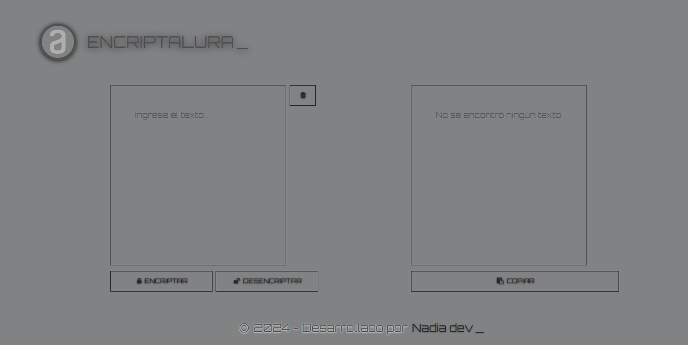

<h1 style="text-align: center;">Encriptador Web 🔐</h1>

## Descripción
Este proyecto consiste en una página web que permite a los usuarios cifrar y descifrar texto ingresado. La aplicación utiliza JavaScript para manipular el texto y aplicar algoritmos de cifrado y descifrado. Además, se proporciona un estilo visual atractivo mediante CSS para mejorar la experiencia del usuario.

## Funcionalidades Principales
- **Cifrado y Descifrado de Texto:** Los usuarios pueden ingresar texto en un área de entrada designada y utilizar los botones de cifrado y descifrado para procesar el texto según sea necesario.
- **Validación de Entrada:** Se realizan comprobaciones para garantizar que el texto ingresado cumpla con ciertos criterios, como estar compuesto solo por letras minúsculas sin acentos.
- **Copiar Texto:** Se proporciona un botón para copiar el texto cifrado o descifrado al portapapeles del usuario.
- **Actualización de Caché:** El proyecto utiliza una estrategia para evitar el almacenamiento en caché de los recursos CSS mediante la modificación de las URL de los archivos CSS.

## Tecnologías Utilizadas
- HTML5
- CSS3
- JavaScript

## Requisitos
- Navegador web moderno compatible con HTML5, CSS3 y JavaScript.

## Instrucciones de Uso
1. Clona o descarga el repositorio en tu máquina local.
2. Abre el archivo `index.html` en tu navegador web.
3. Ingresa el texto que deseas cifrar o descifrar en el área de entrada provista.
4. Selecciona la acción de cifrado o descifrado según corresponda.
5. Utiliza el botón "Copiar" para copiar el texto procesado al portapapeles si es necesario.

## Autor
- [Nadia Escobar](https://www.linkedin.com/in/nadia-escobar-2b6095265/) 🚀

